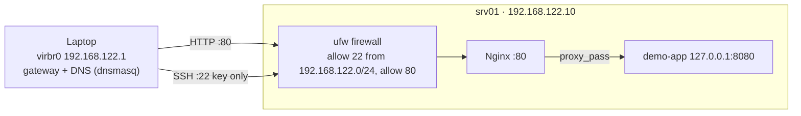

# srv01 network

```mermaid
flowchart LR
    laptop["Laptop<br/>virbr0 192.168.122.1<br/>gateway + DNS (dnsmasq)"]
    subgraph srv01["srv01 · 192.168.122.10"]
        ufw["ufw firewall<br/>allow 22 from 192.168.122.0/24, allow 80"]
        nginx["Nginx :80"]
        app["demo-app 127.0.0.1:8080"]
    end
    laptop -->|HTTP :80| ufw --> nginx -->|proxy_pass| app
    laptop -->|SSH :22 key only| ufw
```
